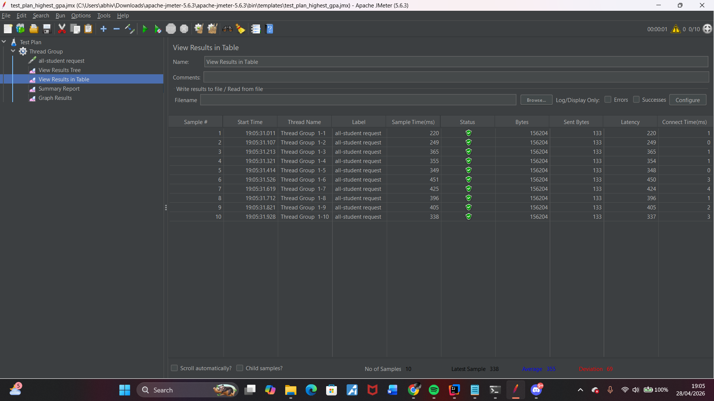
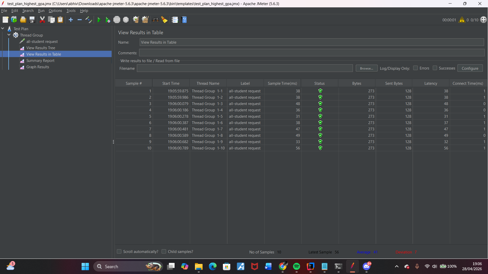
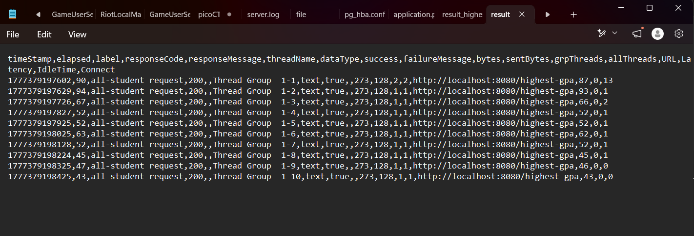
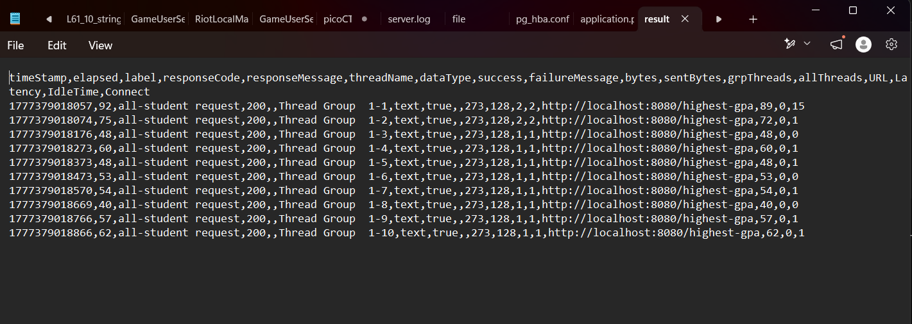
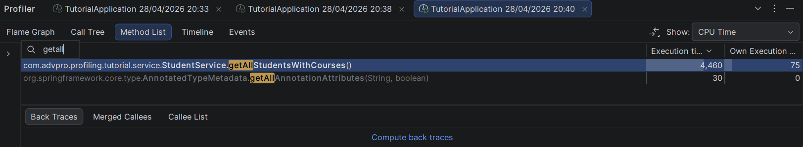
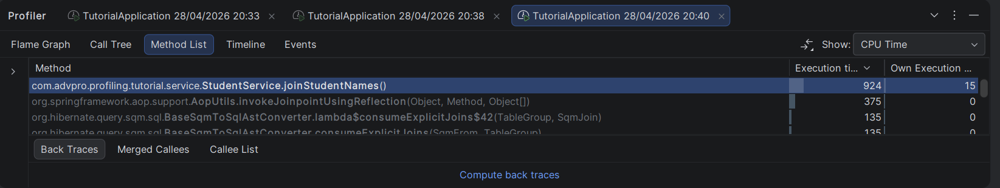
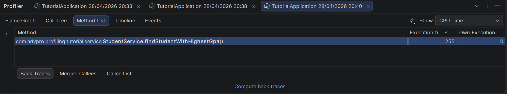

## Performance Testing

### Endpoint `/all-student`

### Endpoint `/all-student-name`

### Endpoint `/highest-gpa`

### Command Line Testing `/all-student-name`

### Command Line Testing `/highest-gpa`

### Perbandingan Hasil JMeter

Setelah kode dioptimasi, saya menjalankan ulang performance test menggunakan JMeter untuk endpoint `/all-student`, `/all-student-name`, dan `/highest-gpa`. Dari hasil pengujian ulang, ketiga endpoint menunjukkan peningkatan performa dibandingkan dengan hasil pengujian awal.

Peningkatan paling terasa ada pada bagian yang sebelumnya melakukan proses berulang atau mengambil data terlalu banyak dari database. Pada endpoint `/all-student`, query yang sebelumnya dilakukan berkali-kali sudah dikurangi. Pada endpoint `/all-student-name`, aplikasi tidak lagi mengambil seluruh data student karena yang dibutuhkan hanya nama. Untuk endpoint `/highest-gpa`, pencarian GPA tertinggi juga sudah langsung dilakukan lewat repository, sehingga tidak perlu lagi melakukan looping manual di Java.

Dari hasil tersebut, dapat disimpulkan bahwa refactoring yang dilakukan berhasil membuat proses request menjadi lebih ringan dan lebih efisien.

#### SCREENSHOT BEFORE OPTIMIZATION

##### `/all-student`

##### `/all-student-name`

##### `/highest-gpa`

#### SCREENSHOT AFTER OPTIMIZATION

## Reflection

### 1. What is the difference between the approach of performance testing with JMeter and profiling with IntelliJ Profiler in the context of optimizing application performance?

Performance testing dengan JMeter lebih fokus untuk melihat performa aplikasi dari sisi luar, misalnya response time, throughput, error rate, dan kemampuan aplikasi saat menerima banyak request. Jadi JMeter membantu melihat apakah endpoint terasa lambat atau tidak ketika diakses seperti user sungguhan.

Sedangkan IntelliJ Profiler lebih fokus ke sisi dalam aplikasi. Profiler membantu melihat bagian kode mana yang memakan CPU time paling besar, method mana yang sering dipanggil, dan bagian mana yang menjadi bottleneck. Jadi JMeter menunjukkan bahwa ada masalah performa, sedangkan IntelliJ Profiler membantu mencari penyebab masalah tersebut di level kode.

### 2. How does the profiling process help you in identifying and understanding the weak points in your application?

Profiling membantu saya melihat method mana yang paling banyak memakan waktu saat endpoint dijalankan. Dari hasil profiling, saya bisa mengetahui apakah masalahnya berasal dari looping yang terlalu banyak, query database yang berulang, atau proses di Java yang sebenarnya bisa dibuat lebih efisien.

Dalam modul ini, profiling membantu menunjukkan bahwa beberapa endpoint masih melakukan proses yang kurang optimal, seperti mengambil semua data lalu memprosesnya manual di Java. Dengan melihat hasil profiler, saya bisa lebih mudah menentukan bagian mana yang perlu direfactor terlebih dahulu.

### 3. Do you think IntelliJ Profiler is effective in assisting you to analyze and identify bottlenecks in your application code?

Menurut saya IntelliJ Profiler cukup efektif karena hasilnya langsung terhubung dengan kode yang sedang dikerjakan di IntelliJ. Saya bisa melihat method list, call tree, dan CPU time dari method yang dijalankan. Hal ini memudahkan untuk menemukan bagian kode yang paling berat.

Selain itu, IntelliJ Profiler juga membantu membedakan apakah bottleneck terjadi di logic aplikasi, repository, atau proses lain seperti Hibernate dan database access. Jadi proses analisis tidak hanya berdasarkan perkiraan, tetapi berdasarkan data dari eksekusi program.

### 4. What are the main challenges you face when conducting performance testing and profiling, and how do you overcome these challenges?

Tantangan utama saat performance testing adalah hasil pengukuran bisa berubah-ubah tergantung kondisi laptop, jumlah data, kondisi database, dan apakah aplikasi baru pertama kali dijalankan. Untuk mengatasinya, saya tidak hanya mengandalkan satu kali run, tetapi menjalankan endpoint beberapa kali agar hasilnya lebih stabil.

Tantangan saat profiling adalah mencari method yang tepat di antara banyak method internal dari Spring, Hibernate, dan Java. Untuk mengatasinya, saya mencari method berdasarkan nama service yang saya buat, seperti `StudentService`, lalu melihat alur pemanggilannya melalui method list atau call tree.

### 5. What are the main benefits you gain from using IntelliJ Profiler for profiling your application code?

Manfaat utama dari IntelliJ Profiler adalah saya bisa melihat bagian kode yang benar-benar memakan waktu paling besar. Dengan begitu, optimasi yang dilakukan menjadi lebih terarah dan tidak asal mengubah kode.

Profiler juga membantu saya memahami hubungan antara endpoint, service, repository, dan query database. Dari situ saya bisa melihat bahwa beberapa proses lebih baik dipindahkan ke query repository daripada dilakukan manual di Java, seperti pencarian student dengan GPA tertinggi atau pengambilan nama student saja.

### 6. How do you handle situations where the results from profiling with IntelliJ Profiler are not entirely consistent with findings from performance testing using JMeter?

Jika hasil dari IntelliJ Profiler dan JMeter tidak sepenuhnya sama, saya akan melihat keduanya dari sudut pandang yang berbeda. JMeter menunjukkan performa dari sisi request secara keseluruhan, sedangkan IntelliJ Profiler menunjukkan detail eksekusi di dalam aplikasi.

Perbedaan hasil bisa terjadi karena JMeter juga dipengaruhi oleh faktor jaringan lokal, response serialization, database, dan kondisi runtime aplikasi. Karena itu, saya akan menjalankan pengujian beberapa kali, tidak memakai hasil dari run pertama, lalu membandingkan pola umumnya. Jika profiler menunjukkan CPU time menurun dan JMeter juga menunjukkan response yang lebih baik secara umum, maka optimasi dapat dianggap berhasil.

### 7. What strategies do you implement in optimizing application code after analyzing results from performance testing and profiling? How do you ensure the changes you make do not affect the application's functionality?

Strategi optimasi yang saya lakukan adalah mengurangi query yang tidak perlu, menghindari proses manual yang terlalu berat di Java, dan mengambil data sesuai kebutuhan saja. Contohnya, untuk endpoint `/highest-gpa`, pencarian GPA tertinggi dipindahkan ke repository agar database yang melakukan proses sorting. Untuk `/all-student-name`, aplikasi hanya mengambil nama student, bukan seluruh object student. Untuk `/all-student`, pengambilan data dibuat lebih langsung agar tidak melakukan query berulang.

Untuk memastikan fungsionalitas tetap aman, saya menjalankan ulang aplikasi dan mencoba endpoint yang sudah dioptimasi melalui browser. Saya juga membandingkan output endpoint sebelum dan sesudah optimasi secara umum agar tetap sesuai dengan kebutuhan. Setelah itu, saya menjalankan performance test ulang untuk memastikan perubahan tidak hanya benar secara fungsional, tetapi juga memberikan peningkatan performa.